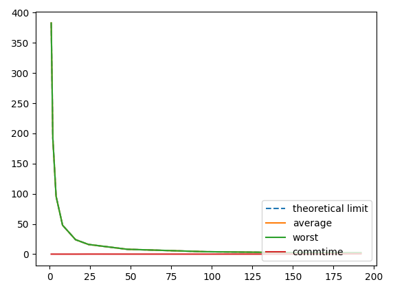

# COS760
### José Luiz Oliveira
## Experimental methodology


### Input data
The input data from burma14.tsp, consisting of 14 cities, was used:
```
   1  16.47       96.10
   2  16.47       94.44
   3  20.09       92.54
   4  22.39       93.37
   5  25.23       97.24
   6  22.00       96.05
   7  20.47       97.02
   8  17.20       96.29
   9  16.30       97.38
  10  14.05       98.12
  11  16.53       97.38
  12  21.52       95.59
  13  19.41       97.13
  14  20.09       94.55
```
### Algorithm:
The permutation algorithm was chosen to guarantee the best answer.
In this algorithm, all permutations of cities are tested and the shortest time is chosen. This algorithm is easily parallelizable since the generation of permutations does not depend on previous results, however, its complexity is O(n!), making it impossible to scale to larger problems. However, for the tested data set, it is a feasible total number of operations (13! = ~6bi operations).
### Implementation and optimizations
To perform the operation in parallel, the strategy used was to generate multiple initial paths and for each initial path, the application is responsible for obtaining the best possible path. In the end, just choose the best route among all the initial paths.
Due to the complexity of writing the software responsible for performing the N,k permutation for the initial paths, this step is done through a Python script, which generates the header file included by the program. This script is also responsible for reading the input file and calculating the 14x14 matrix of distances between cities. This pre-calculation of distances avoids calling the function ```calculate_distance(i,j) => ((coords[i].x - coords[j].x) ^2+(coords[i].y - coords[j]. y) ^2 )^0.5``` , which performs 4 memory accesses in addition to calculating a square root. This way, when pre-computing the distance matrix, the function can be replaced by a single memory access:
```calculate_distance(i,j) => distance[i][j]```;
Permutations are performed for the first 5 cities (the first city is always 0), totaling 11880 possible initial paths.
In the OpenMP application, a parallel for loop is performed to obtain the best path for each of the 11k initial paths and then a sequential for loop is performed to obtain the best of the 11 thousand paths
```c
struct bestPath resultArr[TOTAL_JOBS];
#pragma omp parallel for  shared(resultArr)
for (int i = 0; i < TOTAL_JOBS; i++)
{
  solve(jobs[i], &resultArr[i]);
}
best = &resultArr[0];
for(int i=0;i<TOTAL_JOBS;i++){
    if(resultArr[i].cost < best->cost){
        best = &resultArr[i];
    }
}
printf("Best cost: %lf\n",best->cost);
printArray(best->path,TOTAL_CITIES);
```
A similar strategy is performed with the MPI code, however, the tasks are distributed explicitly according to the rank of each node.
The root MPI application calculates its batch of paths and expects a response from the other nodes:
```c
if ( rank == 0 ) {
    printf("max rank %d\n",world_size);
    resultArr = malloc(sizeof(struct bestPath)*world_size);
    start = MPI_Wtime();
    solveJob(rank,world_size,resultArr);

    for(int i=1;i<world_size;i++){
        MPI_Recv(&resultArr[i], sizeof(struct bestPath), MPI_CHAR, MPI_ANY_SOURCE, 0, MPI_COMM_WORLD, &Stat);
        //printf("recv job %i...\n",i);
    }

    //get the best result again...
    struct bestPath *bestfinal = resultArr;
    for(int i=0;i<world_size;i++){
        if(resultArr[i].cost < bestfinal->cost){
            bestfinal = &resultArr[i];
        }
    }
    printf("Best cost: %lf\n",bestfinal->cost);
    printArray(bestfinal->path,TOTAL_CITIES);
    end = MPI_Wtime();
    printf("elapsed time %lf \n",end-start);
    }
else if ( rank > 0 ) {
    solveJob(rank,world_size,&best);
    MPI_Send(&best, sizeof(struct bestPath), MPI_CHAR, 0, 0, MPI_COMM_WORLD);
}
```
The paths are divided between each node according to their rank and the total number of available nodes:
```c
int i=rank;
while( i <  TOTAL_JOBS){
    solve(jobs[i], &new);
    if(new.cost < best->cost){
        memcpy(best,&new,sizeof(struct bestPath));
    }
    i +=max_rank;
}
```

This approach doesn't need the initial communication with root to distribute workloads.

## Performance metrics

### Serial performance
The single core performance of each individual task was measured as follows:

```c
//Serial unit of work
void solve(char path[JOB_SIZE], struct bestPath *result){

    double start,end;
    float startCost;
    char pathes[BRUTEFORCE_SIZE];
    char complete_path[TOTAL_CITIES];
    float total_cost;
    int c=0;

    start = getTime();

    for (int i=0;i<TOTAL_CITIES;i++){
        //if not visited
        if(!inArray(i,path,JOB_SIZE)){
            //add to bruteforce
            pathes[c]=i;
            c++;
        }
    }

    result->cost=999999999999999;
    startCost = computeLen(path,JOB_SIZE);

    permute(pathes,0,BRUTEFORCE_SIZE-1,result);

    result->cost += startCost;

    copy(complete_path,path,JOB_SIZE);
    copy(&complete_path[JOB_SIZE],result->path,BRUTEFORCE_SIZE);
    copy(result->path,complete_path,TOTAL_CITIES);

    end = getTime();
    printf("Serial unity work time:%lf\n",end-start);

}

```
Obtaining the following results:
```
joliveira@r2i4n17:~/cos770> mpirun -n 4 ./tspMPI
max rank 4
Serial unity work time:0.032226
Serial unity work time:0.032240
Serial unity work time:0.032230
Serial unity work time:0.032503
Serial unity work time:0.032216
Serial unity work time:0.032212
Serial unity work time:0.032239
Serial unity work time:0.032232
[...]
joliveira@r2i4n17:~/cos770> OMP_NUM_THREADS=4 ./tspOMP
Numero max de threads= 4
Serial unity work time:0.032246
Serial unity work time:0.032267
Serial unity work time:0.032257
Serial unity work time:0.032298
Serial unity work time:0.032228
Serial unity work time:0.032233
Serial unity work time:0.032241
Serial unity work time:0.032232
Serial unity work time:0.032229

Average: 0.03223s per job
```
This result will be important to indirectly measure the communication time of the implicit ompenMP communication later.
### Simultaneous Multithreading
The Computer used for the benchmark contains the following characteristics:
* 6048 cores
* 252 nodes
Each node is an Intel(R) Xeon(R) CPU E5-2670 v3 @ 2.30GHz (“Haswell”), with 24 cores, each with 2 threads. When using hyperthread the CPU execution unit is shared between both running threads, which can lead to a slower performance when compared to two processors on different cores.
The test below executed on 192 MPI threads, but allocated on 8 nodes:

```c
max rank 192
Serial unity work (181) time:1.966813
Serial unity work (184) time:1.966837
...
Communication time 0.412425
Best cost: 31.593506
0 7 10 8 9 1 12 6 11 5 4 3 2 13
final count time 0.000001
elapsed time 2.414286

real    0m3.421s
user    0m0.080s
sys     0m0.032s
```
The same application is then executed with 192 MPI processes, but allocated on only 4 nodes, therefore forcing SMT
```c
max rank 192 =>hyperthread
...

Communication time 0.057043
Best cost: 31.593506
0 7 10 8 9 1 12 6 11 5 4 3 2 13
final count time 0.000001
elapsed time 3.596475

real    0m4.859s
user    0m0.048s
sys     0m0.012s
```

When using SMT the measured result is on average 48% slower than when using only one core per thread. Therefore, for the rest of the tests, the topology
is chosen such as SMT is not used.

## Speedup
the speedup can be calculated by the following formula:
```
Speedup of n processors: total_execution_time(1)/total_execution_time(n)
```
For this algorithm is expected a linear speedup, since there are almost no data dependency between tasks, it's only necessary to collect all results at the end of the processing.

The best scenario is a speedup equal to the number of processors used.
below is the speedup graphic for both MPI and openMP applications:


Here we can see for the optimized MPI application the speedup stays almost linear until reaching 196 cores. The linear result is expected and the performance will be explained in the next graph.
However, the OpenMP results seem to have a maximum limit of 25 speedup. This can be explained by the implicit communication time between nodes.

### Measuring MPI "Batches"
Since MPI code allows to use of more optimized workloads, the list of serial jobs is manually divided between the nods each node receiving its batch of jobs. The time spent per node for executing its batch can be measured. 


It is also possible to measure The communication time in the end:
```c
if ( rank == 0 ) {
        printf("max rank %d\n",world_size);
        solveJob(rank,world_size,resultArr);
        comms=getTime();
        for(int i=1;i<world_size;i++){
            MPI_Recv(&resultArr[i], sizeof(struct bestPath), MPI_CHAR, MPI_ANY_SOURCE, 0, MPI_COMM_WORLD, &Stat);
        }
        commen=getTime();
        printf("Communication time %lf\n",commen-comms);

    }
```

This results in a list of execution time per node, as below:
```
1 node:
    Serial unity work (0) time:382.920333
    Communication time 0.000000
    elapsed time 382.920358
2 nodes: 
    Serial unity work (0) time:191.509311
    Serial unity work (1) time:191.530541
    Communication time 0.021729
    elapsed time 191.531067
4 nodes:
    Serial unity work (3) time:95.730359
    Serial unity work (2) time:95.739169
    Serial unity work (1) time:95.752425
    Serial unity work (0) time:95.761959
    Communication time 0.000041
    elapsed time 95.762026
    ...
```
Since the communication time is expected to be minimal, and all the batches have almost the same amount of operations, it's expected the same time for each batch, but the total time is set by the worst batch time.
However when testing with 192 cores:
```
192 nodes:
...
Serial unity work (189) time:2.074611
Serial unity work (186) time:2.115218
Serial unity work (180) time:2.289249
Serial unity work (188) time:2.370007
Serial unity work (168) time:2.396941
Serial unity work (183) time:2.405566
Communication time 0.412425
Best cost: 31.593506
0 7 10 8 9 1 12 6 11 5 4 3 2 13
final count time 0.000001
elapsed time 2.414286
    ...
```
One of the nodes took 0.4 seconds more to process, leading to 0.4s of communication time, losing the linear speedup characteristic.
This result can be seen in the graphic below:


Or in the graphic below in logarithm scale:


With a zoom on the last test:


### Estimating OMP communication time
since it's not possible to directly measure communication in OpenMP applications, we previously measured the single job performance as an average of 0.03223s per job.
The communication time must be then:
```c
CommTime = Total_time -  (0.03223*(TotalJobs/total_cores))
```
When estimating this parameter, it's possible to see that the performance stays close to linear until 24 cores, which is the size of processors inside a single node. After this, the estimated communication time increases drastically limiting the performance gains.


### Bias in favor of MPI
For the MPI application, the time is measured after the MPI_INIT call, which introduces some setup overhead. The OMP is measured since the startup of the application.
For example, in a 192 core, the measured time is 3.5 seconds, but the real time measured with the Linux time tool, is 4.8, duo the MPI_INIT setup between multiple nodes:
```
Serial unity work (144) time:3.595565
Communication time 0.057043
Best cost: 31.593506
0 7 10 8 9 1 12 6 11 5 4 3 2 13
final count time 0.000001
elapsed time 3.596475

real    0m4.859s
user    0m0.048s
sys     0m0.012s
```

### Conclusion
The chosen algorithm had performance similar to expected (linear) when developed using MPI. The presence of communication implicated in OpenMP prevented the use of more intelligent task distribution strategies, such as using the node number to select loads, causing a limit in speedup, due to the introduction of additional serial processing due to communication.


